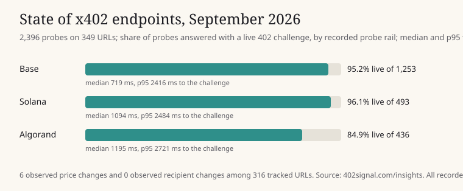

# State of x402 endpoints, September 2026

Generated by `scripts/endpoint_report.py` from a read-only copy of 402Signal's shadow catalog (listings from the CDP, PayAI and GoPlausible discovery feeds) and its own probe history for the 30 days ending 2026-09-13. Probes are triggered by checks and readiness lookups, not uniform sampling; treat rates as observed, not population estimates. Aggregates and public seller hosts only: no buyer or payer identities. Second edition, re-cut on 2026-09-13 to name hosts and lead with what changed.

## What changed, named

Observed by 402Signal's own probes, comparing successive challenges from the same URL. Every host is treated the same way and the method is published; a seller cannot pay to be left out, and nothing a seller pays for changes these numbers.

| Host | URL | Change | Before | After | Observed | Rail |
|---|---|---|---|---|---|---|
| api.xfuel.app | https://api.xfuel.app/v1/chat/completions | price | $0.010 (10000) | $0.002 (2000) | 2026-09-02 21:58 UTC | solana |
| netintel.dev | https://netintel.dev/gas/price | price | $0.005 (5000) | $0.002 (2000) | 2026-09-03 00:07 UTC | base |
| api.syraa.fun | https://api.syraa.fun/news | price | $0.005 (5000) | $0.010 (10000) | 2026-09-03 02:21 UTC | algorand |
| api.agentstools.dev | https://api.agentstools.dev/search | price | $0.001 (1000) | $0.003 (3000) | 2026-09-10 00:02 UTC | base |
| api.kadec0.xyz | https://api.kadec0.xyz/v1/serp | price | $0.030 (30000) | $0.050 (50000) | 2026-09-10 00:02 UTC | base |

Five sellers changed a price in the period; three up (by 67 percent, by three times, and by two times within four hours of the previous observation), two down. The sixth tracked change was 402Signal's own listing, where the catalog claim and the live challenge differ, and is excluded above. No recipient change was observed in a live challenge. Two of the five (api.syraa.fun and api.xfuel.app) also carried a catalog listing that named a different network and recipient from the live challenge, which is the second thing a buyer planning from a catalog would not see.

The discovery feeds' own change events are kept only briefly in the catalog copy; the first edition of this report, cut from the 2026-09-12 copy, counted one recipient change and eight price changes in listings during the period. Those are feed claims, not observations.

## Catalog

- Listings: 22,124 across 2,359 hosts; 84.9% carry an input schema. The shadow catalog began on 2026-08-30, so every listing counts as new in this first period.
- By discovery source: CDP 15,977, PayAI 7,722, GoPlausible 927.
- Declared facilitators: 0.2% of listings name one. Almost every listing leaves the facilitator implicit, which is why a buyer cannot tell from the catalog alone who will settle a payment.

### Networks by listing share (50 networks seen)

| Network | Listings | Share |
|---|---:|---:|
| Base | 19,893 | 44.8% |
| Solana | 6,846 | 15.4% |
| Polygon | 2,434 | 5.5% |
| Arbitrum One | 2,287 | 5.2% |
| Monad | 1,513 | 3.4% |
| World Chain | 1,159 | 2.6% |
| X Layer | 935 | 2.1% |
| Algorand MainNet | 925 | 2.1% |
| BNB Smart Chain | 911 | 2.1% |
| Algorand MainNet (short id) | 876 | 2.0% |
| XRP Ledger | 864 | 1.9% |
| HyperEVM | 859 | 1.9% |

Base and Solana together are 60% of listings. The next six networks are all EVM chains that share Base's payment scheme (EIP-3009 USDC), and together they add another 20%. 402Signal observes offers on all of them since 2026-09-13; the checking fee is paid on Base, Solana or Algorand.

### Capabilities (top 10)

| Capability | Listings |
|---|---:|
| unknown | 14,292 |
| market.price | 2,237 |
| search.web | 1,368 |
| compute.inference | 1,013 |
| market.analysis | 877 |
| chain.balance | 510 |
| travel.weather | 423 |
| identity.auth | 402 |
| messaging.notify | 328 |
| storage.files | 231 |

Two thirds of listings do not describe what they do well enough for a rule-based classifier to place them. Market data, web search and inference are the largest named categories.

### Largest hosts by listings (top 10)

| Host | Listings |
|---|---:|
| agent402.tools | 1,572 |
| api.delx.ai | 1,014 |
| api.m2mcent.com | 965 |
| api.magentlab.com | 522 |
| k2so.wrong.systems | 515 |
| api.x402node.dev | 508 |
| x402.orthogonal.com | 433 |
| payai.agentstools.dev | 362 |
| api.agentstools.dev | 353 |
| library.forgemesh.io | 317 |

The ten largest hosts hold 30% of all listings.

## Liveness and terms (402Signal probes in the period)

- Probes: 2,396 over 349 URLs on 154 hosts (organic 98, self_test 47, sponsored 5, unclassified 2,246; the unclassified rows predate traffic labelling on 2026-09-11).
- Live 402 challenge: 92.9% of probes; payable 92.7%; invocable (input schema present) 90.6%.
- Latency to a live challenge: p50 863 ms, p95 2,484 ms.
- URLs always live in the period: 285; never live: 50; flapping: 14.
- Terms changes among 316 tracked URLs: 0 recipient changes, 6 price changes, 0 schema changes.

| Rail | Probes | Live | Latency p50 | Latency p95 |
|---|---:|---:|---:|---:|
| algorand | 436 | 84.9% | 1,195 ms | 2,721 ms |
| base | 1,253 | 95.2% | 719 ms | 2,416 ms |
| solana | 493 | 96.1% | 1,094 ms | 2,484 ms |
| unknown | 214 | 88.3% | 333 ms | 1,209 ms |

Why probes missed: no_402_envelope 134, probe_timeout 17, reachable_200 10, upstream_5xx 7, ssrf 2. The dominant miss is a listed URL that no longer answers with an x402 challenge at all.

### Hosts, named (largest by public probes)

| Host | Probes | URLs | Live | Latency p50 | Latency p95 |
|---|---:|---:|---:|---:|---:|
| payai.agentstools.dev | 354 | 41 | 100.0% | 1,116 ms | 2,322 ms |
| agent402.tools | 279 | 35 | 98.6% | 197 ms | 1,988 ms |
| api.kadec0.xyz | 166 | 8 | 100.0% | 744 ms | 2,239 ms |
| api.syraa.fun | 138 | 8 | 100.0% | 1,436 ms | 2,568 ms |
| api.agentstools.dev | 105 | 9 | 100.0% | 616 ms | 2,081 ms |
| agenthub-production-8c75.up.railway.app | 94 | 11 | 67.0% | 525 ms | 1,763 ms |
| api.eckari.com | 69 | 1 | 100.0% | 1,357 ms | 2,797 ms |
| ai-data-marketplace-1042299154756.us-central1.run.app | 66 | 2 | 100.0% | 1,077 ms | 2,002 ms |
| netintel.dev | 57 | 8 | 100.0% | 180 ms | 1,685 ms |
| 402.com.tr | 54 | 6 | 100.0% | 859 ms | 2,637 ms |
| x402.ottoai.services | 52 | 5 | 100.0% | 805 ms | 2,081 ms |
| agriintellect.site | 45 | 2 | 100.0% | 2,213 ms | 4,237 ms |
| api.delx.ai | 38 | 5 | 100.0% | 1,440 ms | 2,377 ms |
| api.onesource.io | 31 | 2 | 100.0% | 84 ms | 301 ms |
| hash-hmac.underscoredone.com | 31 | 1 | 100.0% | 164 ms | 1,079 ms |

Each host has a public page at https://402signal.com/endpoints/<host> with the same numbers, an embeddable badge and a claim link.

## What this says

1. Prices move, and not only up. Five sellers changed a price in a month; the largest jump was 67 percent overnight with no change to the listing. A buyer that plans from a catalog price and does not check the live challenge at payment time pays whatever the challenge says.
2. Roughly one listed URL in seven that 402Signal was asked about did not answer with a valid challenge. A catalog listing is not a live offer.
3. Latency to a challenge is measured in seconds at p95 on every rail; the fastest hosts answer in under 200 ms. Buyers that time out at one second will miss live sellers.
4. Listing share, not chain count, should drive which networks a checker observes: Base, Solana, then the EVM chains.

## Method

A listing is a resource advertised by a facilitator discovery feed. A probe is an unpaid HTTPS GET (with a narrowly justified empty POST fallback) from 402Signal to the listed URL; live means the seller answered with an x402 402 challenge; payable means the challenge carried a complete supported offer; invocable adds an input schema. Latency is round trip to the challenge from Fly.io iad. Recipient and price changes compare successive observations of the same URL; the before and after values in the named table come from the observation rows on either side of the change clock. Sponsored and lab traffic classes are 402Signal's own tests and are shown separately; public reliability data on 402signal.com excludes them. Hosts are named because they are public catalog listings; neutrality means publishing the method and treating every host the same, not hiding the data.
